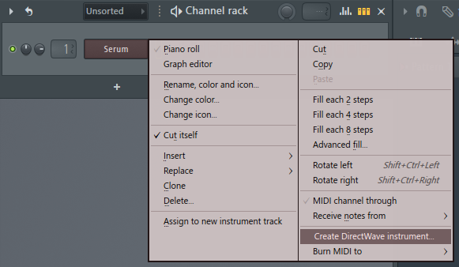
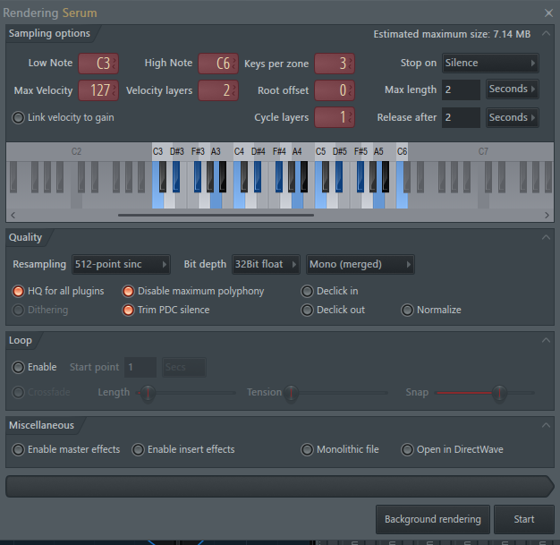
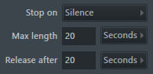
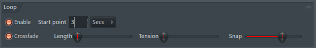
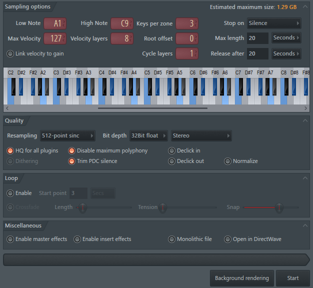

# FLStudio resampling settings

## General recommendations

Resampling is usually best when achieved on a dry signal source, so consider disabling any time based effects like delays, echos, chorus and reverbs has they can be reapplied later on when the resampled instrument is performed by the player.

---

## How to resample instrument from FLStudio

### 1. Load any instrument in FLStudio

- Channel rack > right click on the loaded instrument, here 'Serum' then select "Create DirectWave instrument" from the contextual menu :
  
- select a destination where to save the files

### 2. Select key range : Low Note / High Note


Select keys per zone :

- piano/key instruments usually seats between A1 - C9
- bass instruments usually seats between C2 - C5

### 3. Select velocity layers

Number of layers is related to the type of instrument :

- 1 velocity layer is suitable for electronic drumkit, electronic bass, pad which are not velocity sensitive
- 4 to 8 velocity layers for more detailed instruments : piano, acoustic drumkit

```note
increasing the number of layers also increases the number of recorded samples so the size of the sampled instrument will increase as well.
```

### 4. Select keys per zone

keys per zone :

- 1 (resample every notes): for drumkit / oneshots sammples
- 3 (resamples every 3 semitones): for instruments to have the best quality/size compromize

### 5. Select resampling duration



- Stop on : Silence
- Max length = Release after (in secs) : 5 to 20 secs depending on instrument tail

---

## (OPTIONAL) Resampling looped instrument / create sustaining loop points

- Some instruments articulations like violin legato/sostenuto, or pads are persistents when note is not released by the player. For such instrument, some resampling settings must be activated in order to capture sustaining loop point.
  
  Loop :

- ✅Enable, adapt start point according to sound envelop, 2-3 secs usually fit well for most of the instruments

- ✅Crossfade
  - Length to minimum (slider to left)
  - Tension to minimum (slider to left)
  - Snap to default (alt + click)

---

## EXAMPLE : Settings for resampling key sensitive piano with 8 velocity layers


