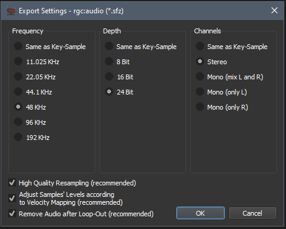

# SampleRobot resampling settings

## General recommendations

Resampling is usually best when achieved on a dry signal source, so consider disabling any time based effects like delays, echos, chorus and reverbs has they can be reapplied later on when the resampled instrument is performed by the player.

---

## How to resample instrument from SampleRobot

### 1. Using project templates

Open startup template in SampleRobot :

- sin.SRprj : template for 2 velocity layers
- sin_looped.SRprj : template for 2 velocity layers with autoloop enabled

### 2. Export

- Import/Export > Export selected Project as > rgc:audio (\*.sfz)
- export as 48kHz, 24 Bit Stereo :
- 
